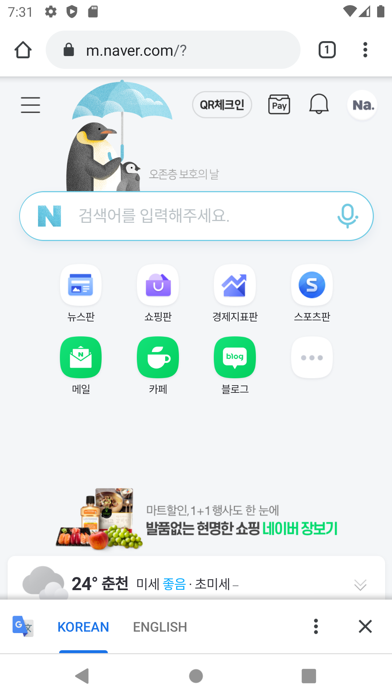
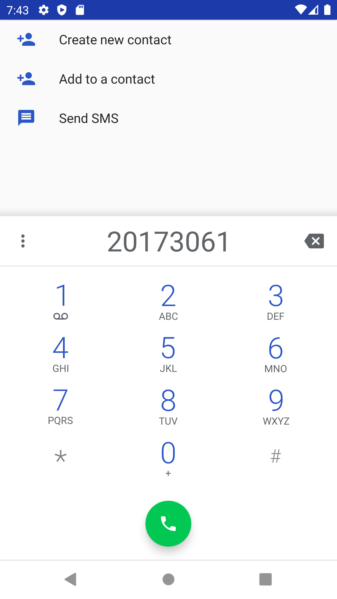
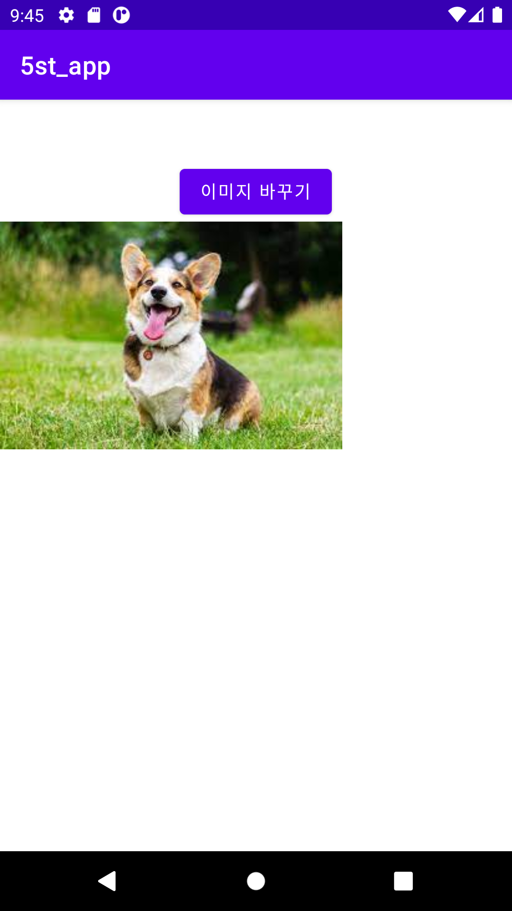
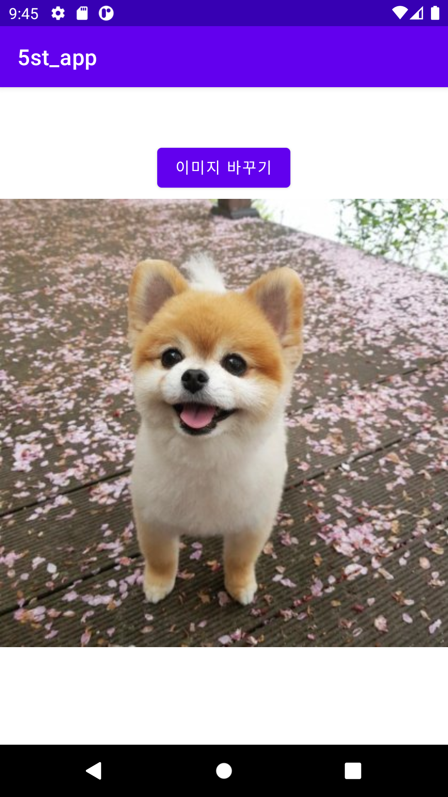
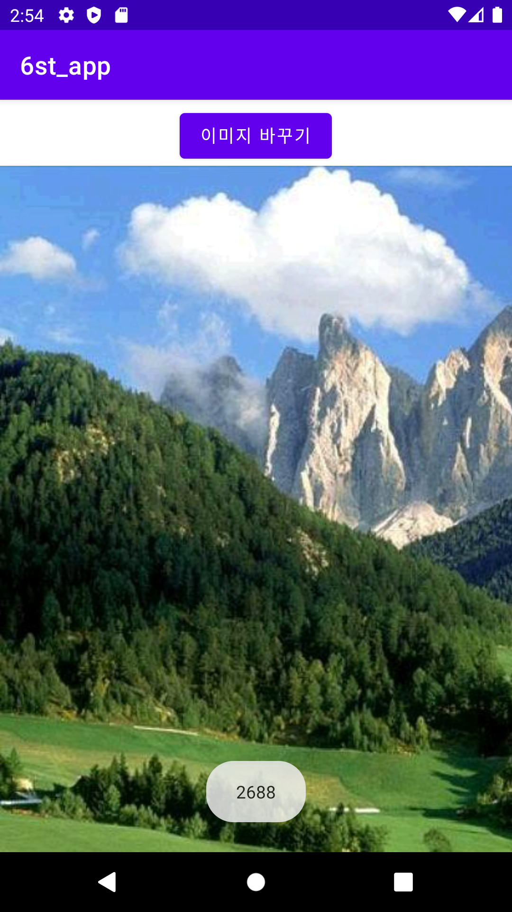
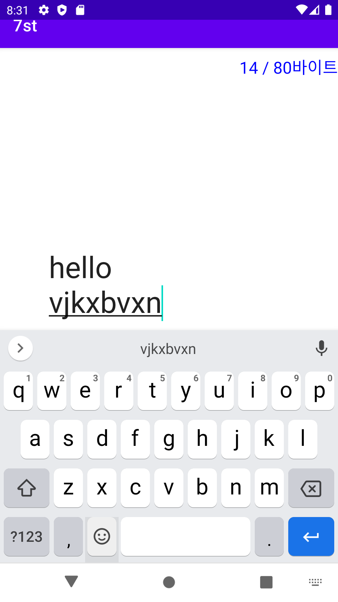
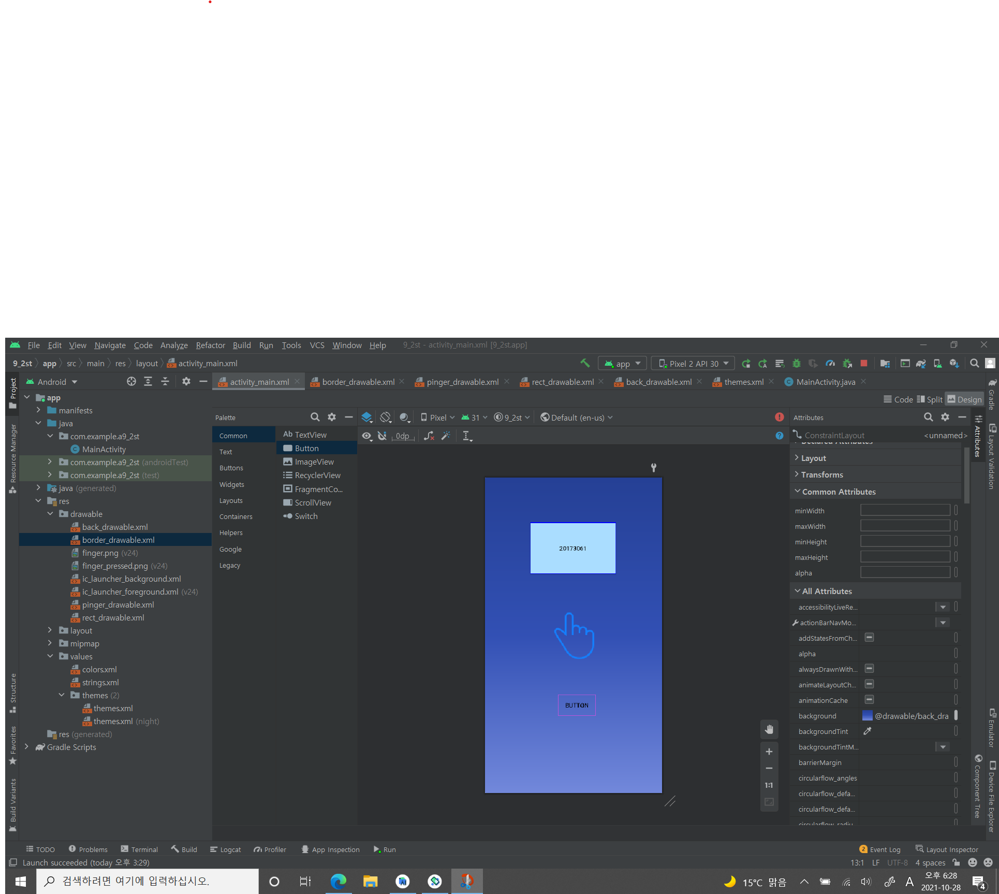
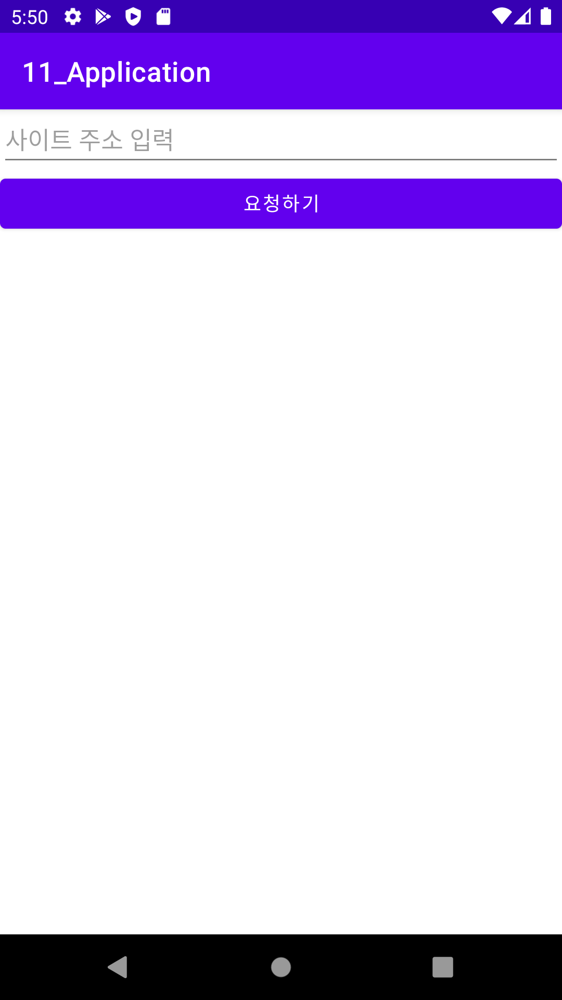
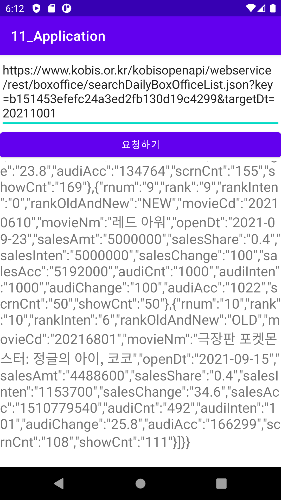
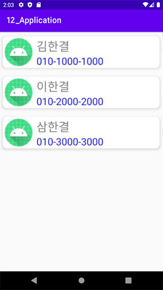

# 20173061_kim_yu_jin
# 20173061 김유진

## 1주차과제

## 2주차과제
  -Github사용법
  
  -안드로이드앱 프로그래밍 시작
  
    -Toast알림
  
    -AVD시작하기
   
</img>

## 3주차 과제
</img>
</img>

## 4주차 과제
   ### -여행계획을 대신 짜주는 어플
 -여행 전문가들과 파워 블로거들과 함께 만드는 어플로 의뢰자의 취향과 성향을 고려하여 상담을 통하여 여행 경로와 식당,카페,숙소 크게는 교통까지 알아서 준비해주는 서비스 어플이다

-금액은 여행 날짜와 목록에 따라 측정된다

-급하게 여행을 떠나고 싶거나 여행 계획 짜는것이 서툰 사람들을 위해 편리한 어플을 만들고 싶다.

## 5주차 과제
</img>
</img>
## 6주차 과제
</img>

## 7주차 과제
</img>

## 9주차 과제
</img>

## 10주차 과제
lms사이트에 올림

## 11주차 과제
</img>
</img>

## 12주차 과제
</img>
